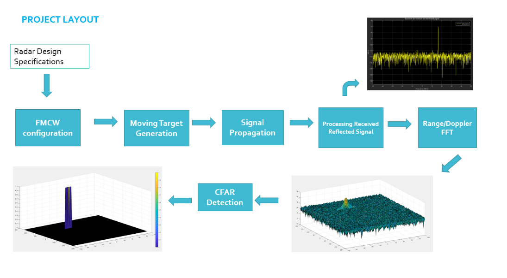
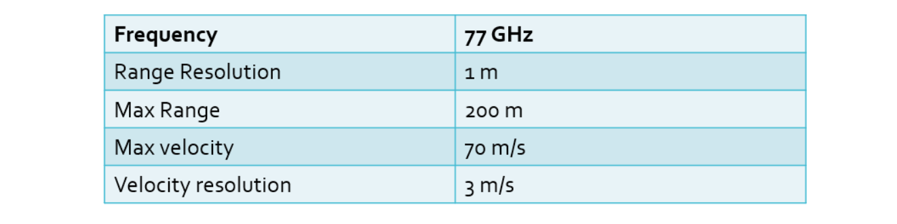
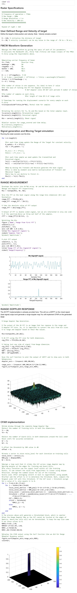

# Radar Target Generation and Detection

## Project Overview

- Configure the FMCW waveform based on the system requirements.
- Define the range and velocity of target and simulate its displacement.
- For the same simulation loop process the transmit and receive signal to determine the beat signal
- Perform Range FFT on the received signal to determine the Range
- Towards the end, perform the CFAR processing on the output of 2nd FFT to display the target.

## Radar System Requirements

 

## Code and Results

